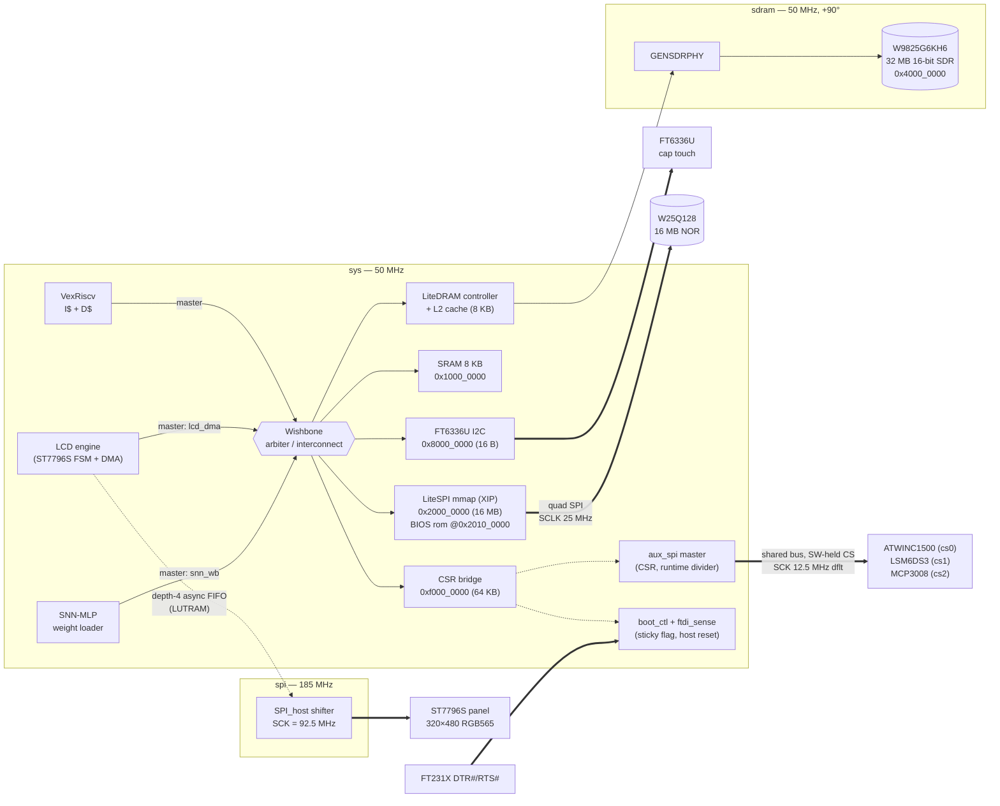
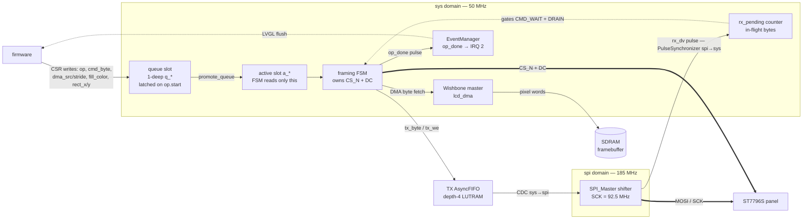
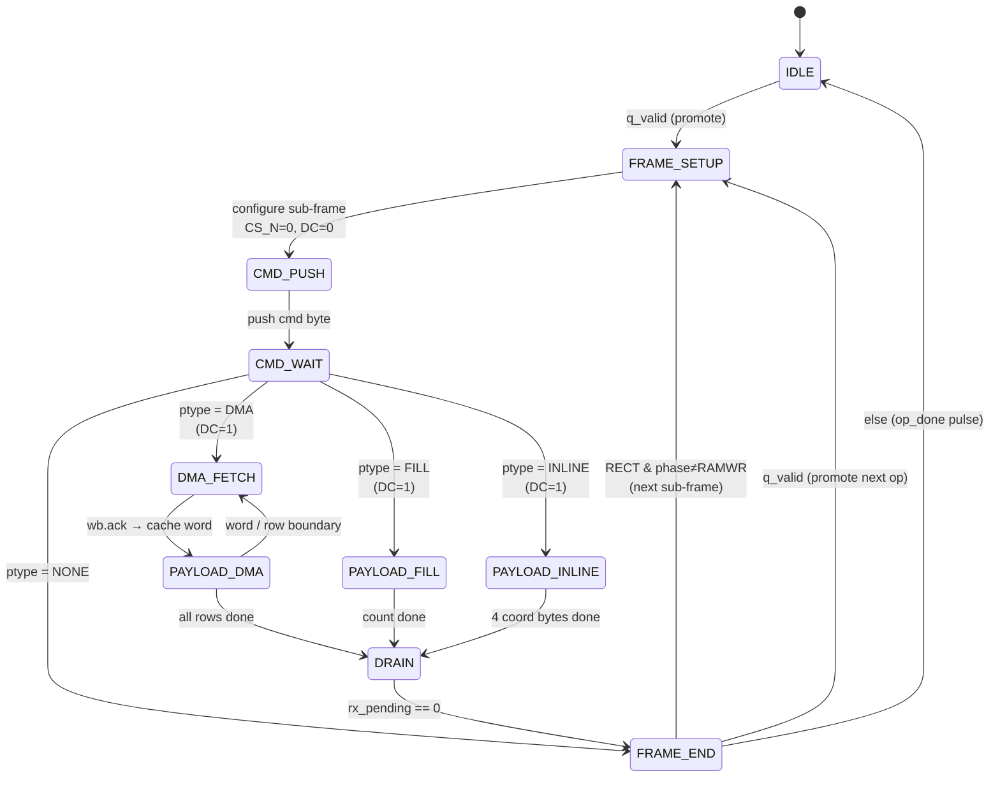
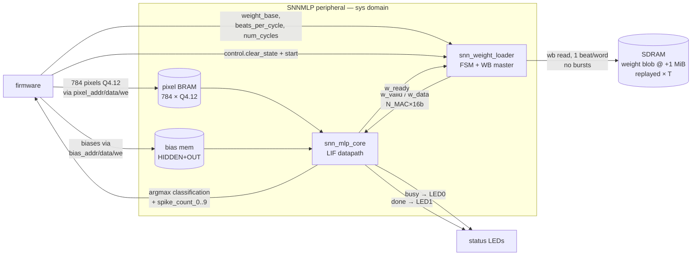
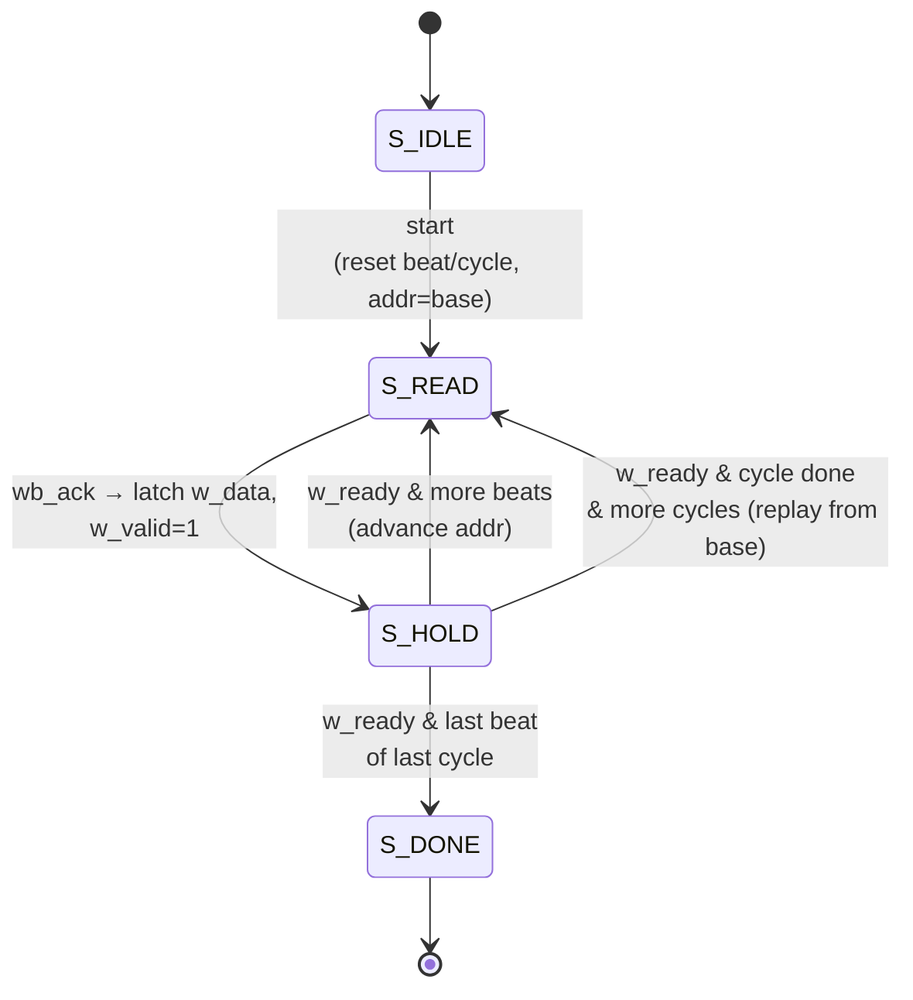

# AllSoC layout

Block diagram of `AllSoC` (`icepi_zero_all.py`) — the deployed "everything"
shape, composed from `gateware/soc_features.py` feature adders on `BaseSoC`.
Generated from the LiteX source and the build's `csr.csv` / `soc.h`; if you
change the bus topology or address map, re-derive it from
`build/icepi_zero/csr.csv`.

The thing worth seeing here is the **interconnect**: three Wishbone masters
(CPU + two DMA engines) arbitrate for one shared SDRAM, and the design spans
**three clock domains** (50 MHz `sys`, a 90°-shifted `sdram`, and a fast
`spi`). Everything else — the aux SPI bus (WINC/IMU/MCP), the flash master,
boot control — is CSR-driven with no bus mastering of its own.

> **MnistLCDSoC (`icepi_zero_mnist_lcd.py`)** is this layout minus the
> WiFi/aux block, flash mmap and boot control: an integrated 128 KB EBR ROM
> at `0x0` replaces the XIP BIOS, 5 IRQs, and the CSR map packs accordingly.
> The other per-feature tops (`icepi_zero_lcd/mnist/winc.py`) subset further.

## Bus topology

The flash sits behind **two paths**: the memory-mapped LiteSPI XIP read path
(CPU fetch/read at `0x2000_0000`, BIOS executes in place from it) and the
CSR-driven LiteSPI **master** (`spiflash` CSRs) used by the loader for
erase/program — mutual-exclusion rules in `docs/boot_chain.md`.

## CSR map (within `0xf000_0000`)

```mermaid
flowchart TB
    csr["CSR bridge<br/>0xf000_0000"]
    csr --> s0["snn        0xf000_0000"]
    csr --> s1["aux_spi    0xf000_0800"]
    csr --> s2["winc_reset 0xf000_1000"]
    csr --> s3["winc_en    0xf000_1800"]
    csr --> s4["winc_irq   0xf000_2000"]
    csr --> s5["boot_ctl   0xf000_2800"]
    csr --> s6["ftdi_sense 0xf000_3000"]
    csr --> s7["ctp_i2c    0xf000_3800"]
    csr --> s8["ctp_int    0xf000_4000"]
    csr --> s9["ctrl       0xf000_4800"]
    csr --> s10["identifier 0xf000_5000"]
    csr --> s11["lcd        0xf000_5800"]
    csr --> s12["sdram      0xf000_6000"]
    csr --> s13["spiflash   0xf000_6800"]
    csr --> s14["timer0     0xf000_7000"]
    csr --> s15["uart       0xf000_7800"]
```

The feature-adder CSR blocks:

| Block | Source | What it is |
|-------|--------|------------|
| `aux_spi` | `gateware/aux_spi.py` | shared SPI master, 3 chip-selects (WINC/IMU/MCP), software-held CS, runtime `clk_divider` |
| `winc_reset` / `winc_en` | `soc_features.py` | GPIOOut sidebands; power-on 0 = WINC powered down (EN wired to IO9) |
| `winc_irq` | `soc_features.py` | GPIOIn on IRQN with IRQ (line 5) |
| `boot_ctl` | `soc_features.py` (`BootCtl`) | sticky `reset_less` boot flag + FTDI DTR/RTS reset detector → `crg.user_rst` |
| `ftdi_sense` | `soc_features.py` | raw DTR#/RTS# levels (bit0/bit1) for the loader's "stay" triage |
| `spiflash` | LiteSPI | flash master (JEDEC/erase/program) next to the XIP mmap |

## Interrupt lines (VexRiscv, 6 total)

| IRQ | Source   | Notes                          |
|-----|----------|--------------------------------|
| 0   | uart     |                                |
| 1   | timer0   | LVGL tick                      |
| 2   | lcd      | op-done → LVGL flush callback  |
| 3   | ctp_i2c  | touch I2C transfer complete    |
| 4   | ctp_int  | FT6336U INT line (polled in fw)|
| 5   | winc_irq | ATWINC1500 IRQN (active low)   |

## Address map

| Region   | Base          | Size  | Type   | Notes |
|----------|---------------|-------|--------|-------|
| sram     | 0x1000_0000   | 8 KB  | cached | stack + `chain_stub` |
| spiflash | 0x2000_0000   | 16 MB | cached | XIP mmap of the whole W25Q128 |
| rom      | 0x2010_0000   | 64 KB | cached | BIOS, alias into spiflash @0x100000 |
| main_ram | 0x4000_0000   | 32 MB | cached | apps execute here; loader IMG_BUF @ +8 MB |
| ctp_i2c  | 0x8000_0000   | 16 B  | io     | |
| csr      | 0xf000_0000   | 64 KB | io     | |

---

# LCD engine detail

Source: `gateware/lcd_engine.py` (FSM + CDC + Wishbone DMA, `sys` domain) and
`verilog/spi/SPI_host.v` (`SPI_Master` shifter, `spi` domain).

Firmware issues **high-level ops** via CSRs; the engine owns `CS_N`/`DC`
framing and, for `*_RECT` ops, emits the full `CASET`/`RASET`/`RAMWR`
sub-frame sequence itself. There are six op kinds:

| `op.kind`        | Sub-frames                       | Payload source |
|------------------|----------------------------------|----------------|
| `CMD` (1)        | 1                                | none           |
| `CMD_DATA_DMA` (2)| 1                               | SDRAM (DMA)    |
| `CMD_DATA_FILL` (3)| 1                              | `fill_color`   |
| `FILL_RECT` (4)  | 3 (CASET, RASET, RAMWR)          | `fill_color`   |
| `DMA_RECT` (5)   | 3 (CASET, RASET, RAMWR)          | SDRAM (DMA)    |

## Block / dataflow

Two details worth calling out, both about decoupling:

- **1-deep op queue + double-buffered op state.** `op.start` latches the live
  CSRs into the `q_*` slot; the FSM runs from the `a_*` (active) copy. So the
  instant firmware fires `start`, it may overwrite CSRs to stage the *next* op
  — that's what feeds LVGL's single-outstanding-flush model without a stall
  between flushes. `status.can_accept` says the queue slot is free.
- **`rx_pending`, not raw `rx_dv`.** Because the SPI shifter is in a faster
  domain, completion comes back as a synchronized pulse. The FSM counts
  bytes-in-flight (push `+1`, `rx_dv` `−1`) so `CMD_WAIT` (don't flip `DC`
  until the command byte has actually clocked out) and `DRAIN` (don't deassert
  `CS` until the payload tail is gone) never miss a pulse.

## Framing FSM

`PAYLOAD_DMA` is the throughput path: it pushes one byte/cycle while the FIFO
has room, hopping back to `DMA_FETCH` on each 32-bit word boundary (the depth-4
FIFO hides fetch latency) and applying `dma_stride` at row boundaries for
strided blits.

---

# SNN engine detail

Sources: `gateware/snn_mlp.py` (LiteX wrapper: CSRs + Wishbone master) wrapping
`verilog/snn_weight_loader.v` and `verilog/snn_mlp_core.v`. Default shape
**784 → 64 → 10**, 25 timesteps, Q4.12 fixed-point, `N_MAC=2`.

The loader and core run in lockstep over a simple **valid/ready handshake**:
the loader streams `N_MAC` weights per beat from SDRAM, the core consumes one
beat per MAC step. `w_ready` is asserted only in the core's MAC states, so the
loader naturally back-pressures to the core's pace.

## Block / dataflow

## Weight-loader FSM

The blob holds **one timestep** of weights; `num_cycles` (= T = 25) replays it
from `base_addr` each timestep. No bursts/pipelining — the core's per-input MAC
cost dominates, so SDRAM has idle headroom (this is the bandwidth argument
behind `N_MAC=2` in `docs/snn_mnist.md`).

## Core FSM (per timestep, ×T then argmax)

```mermaid
stateDiagram-v2
    [*] --> S_IDLE
    S_IDLE --> S_L1_MAC: start
    note right of S_L1_MAC
        Layer 1 (784→64): accumulate
        N_MAC weights × pixel per beat.
        Loops L1_TILES tiles.
    end note
    S_L1_MAC --> S_L1_FIN_A: tile inputs done
    S_L1_FIN_A --> S_L1_FIN_B: pre = leak(mem) + (mac≫FRAC) + bias
    S_L1_FIN_B --> S_L1_MAC: more L1 tiles
    S_L1_FIN_B --> S_L2_MAC: L1 complete<br/>(clip ±3.999, threshold 1.0,<br/>subtract-reset → spk1)

    S_L2_MAC --> S_L2_FIN_A: spike-driven MAC<br/>(add weight iff spike; no shift)
    S_L2_FIN_A --> S_L2_FIN_B: pre = leak(mem) + mac + bias
    S_L2_FIN_B --> S_L2_MAC: more L2 tiles
    S_L2_FIN_B --> S_NEXT_T: L2 complete<br/>(accumulate output spikes)

    S_NEXT_T --> S_L1_MAC: more timesteps
    S_NEXT_T --> S_ARGMAX: T timesteps done
    S_ARGMAX --> S_DONE: argmax over 10 counters
    S_DONE --> [*]
```

The LIF neuron is two combinational stages registered between `*_FIN_A` and
`*_FIN_B`: **Stage A** computes `pre = leak(prev_mem) + shift(mac) + bias`
(leak = `β = 1 − 2⁻³ = 0.875`; the `≫FRAC_BITS` post-MAC shift exists in L1
where the MAC is Q4.12×Q4.12, but **not** in L2 where spike inputs are unitless
0/1); **Stage B** clips to ±3.999, compares against threshold 1.0, and emits a
spike with subtract reset. Output-layer spikes accumulate across all 25
timesteps; `S_ARGMAX` then walks the 10 counters to produce `classification`.
